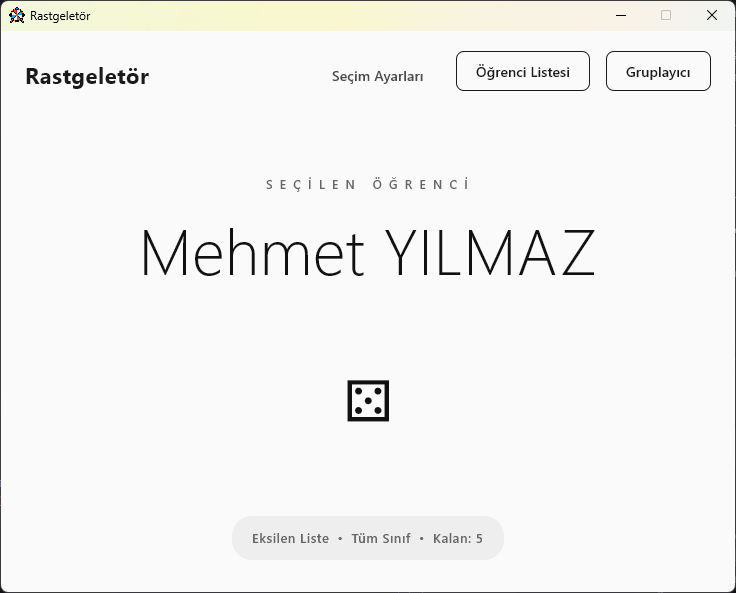
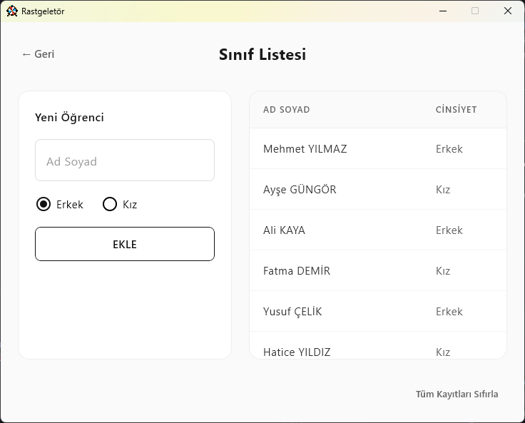
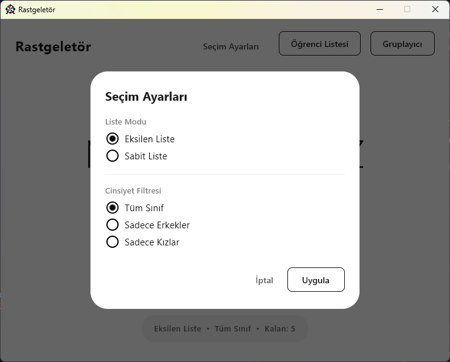
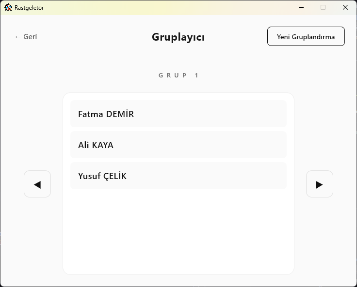

# Rastgeletör - Sınıf Öğrenci Seçme ve Gruplama Aracı

Okullarda akıllı tahta üzerinden kullanılmak üzere tasarlanmış, öğretmenlerin sınıf içi öğrenci seçme ve gruplama aktivitelerini kolaylaştıran modern ve kullanışlı bir masaüstü uygulamasıdır.

<div align="center">
  
  
</div>

> **Not:** Ekran görüntülerinde yer alan isimler test amaçlı tamamen rastgele oluşturulmuş olup, gerçek kişilerle hiçbir ilgisi bulunmamaktadır.

## 🎯 Özellikler

- **Rastgele Öğrenci Seçimi**: Sınıftan adil ve rastgele öğrenci seçimi (Monochrome minimal arayüz)
- **Grup Oluşturma**: İstediğiniz grup sayısına veya grup başına düşen kişi sayısına göre otomatik gruplama
- **Cinsiyet Filtresi**: Tüm sınıf, sadece kızlar veya sadece erkekler arasından seçim
- **Liste Modları**: Eksilen liste (seçilen öğrenci tekrar seçilmez) veya sabit liste
- **Öğrenci Yönetimi**: Kolay öğrenci ekleme, silme ve listeleme

---

## 📸 Uygulama Arayüzü Detayları

### Seçim Ayarları Ekranı
<div align="center">
  
</div>

*Öğretmenler için hızlı ve kolay erişilebilen, göz yormayan ayarlar penceresi.*

### Dinamik Grup Oluşturucu (Gruplayıcı)
<div align="center">
  
</div>

*Girilen kotalara göre adil ve rastgele üretilmiş optimum sınıf grupları.*

---

## 🎮 Kullanım Kılavuzu

### 1- Öğrenci Listesi Oluşturma
1. Ana ekranda "Öğrenci Listesi" butonuna tıklayıp sınıf panosuna girin.
2. Ad soyad ve cinsiyet belirterek **"EKLE"** butonuna tıklayın.
3. Listeyi tamamladığınızda sol üstteki okla geri dönebilir veya verileri temizleyebilirsiniz.

### 2- Rastgele Öğrenci Seçme (Çekiliş)
1. Rastgeletör panosundan **Seçim Ayarları**na tıklayın.
2. Sabit mi yoksa Eksilen liste mantığı ile mi çekiliş yapacağınızı ve kız/erkek kısıtlamalarını belirleyin.
3. Klavyeden **Enter** tuşuna veya ekrandaki kocaman zara (⚄) tıklayarak seçimi gerçekleştirin!

### 3- Grup Oluşturma
1. Sağ üstte yer alan "Gruplayıcı" sekmesine geçin.
2. "Yeni Gruplandırma" diyerek sınıfı kaça böleceğinizi belirleyin.
3. Sağ ve sol oklarla oluşan otomatik grupları inceleyin.

---

## 📦 AppImage Olarak Dağıtım (Linux)

Uygulamanın işletim sistemine tam uyumlu bir `.AppImage` haline getirilmesi için özel `build-appimage.sh` betiği mevcuttur. GNOME ve diğer masaüstü birimlerine (Dock) uygun yapılandırmalar içerir.

### Adımlar

```bash
# Proje dizininde özel betiği çalıştırarak imajı derleyin
chmod +x build-appimage.sh
./build-appimage.sh

# Oluşan AppImage'ı doğrudan çalıştırın
./Rastgeletor-1.0.0-x86_64.AppImage
```
> **Not:** Sisteminizde FUSE yüklü değilse alternatif olarak `./Rastgeletor-1.0.0-x86_64.AppImage --appimage-extract-and-run` bayrağı ile çalıştırabilirsiniz.

## 🛠 Geliştiriciler İçin

**Gereksinimler:**
- JDK 21+
- Gradle 8.5+

**Projeyi Çalıştırma:**
```bash
# Kodu direkt JetBrains Compose Test ortamında çalıştırır
gradle run
```

## 🗄️ Veritabanı Mimarisi
Uygulama `SQLite` kullanır. Standart best-practice politikasını güderek uygulamanın kurulu olduğu yere rastgele çöp dosya bırakmaz. Veriler işletim sisteminin kendisine ait "Application Data" dizininde güvenle barınır:
- **Windows:** `%APPDATA%\Rastgeletor\ogrenciler.db`
- **Linux (WSL):** `~/.local/share/Rastgeletor/ogrenciler.db`

## 🧸 İkon Katkısı
Uygulamanın simgeleri Flaticon'dan alınmıştır.  
<a href="https://www.flaticon.com/free-icons/gaming" title="gaming icons">Gaming icons created by Smashicons - Flaticon</a>

## 📝 Lisans
Bu proje eğitim amaçlı geliştirilmiş olup açık kaynaklıdır.
