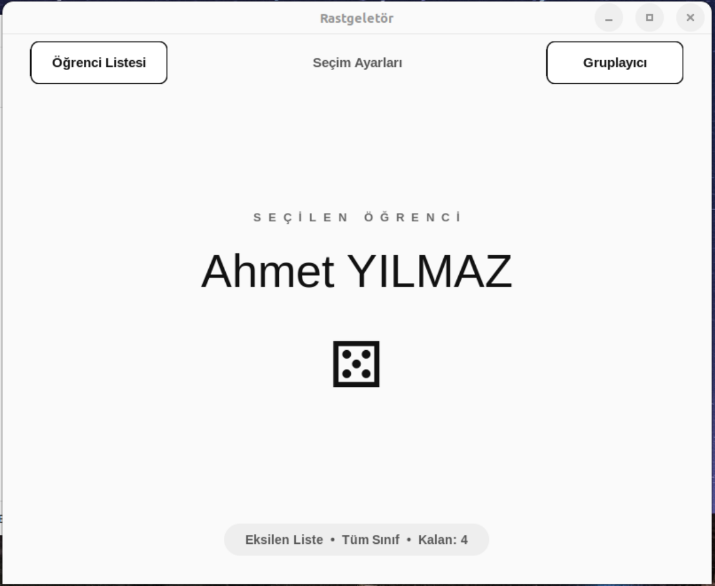
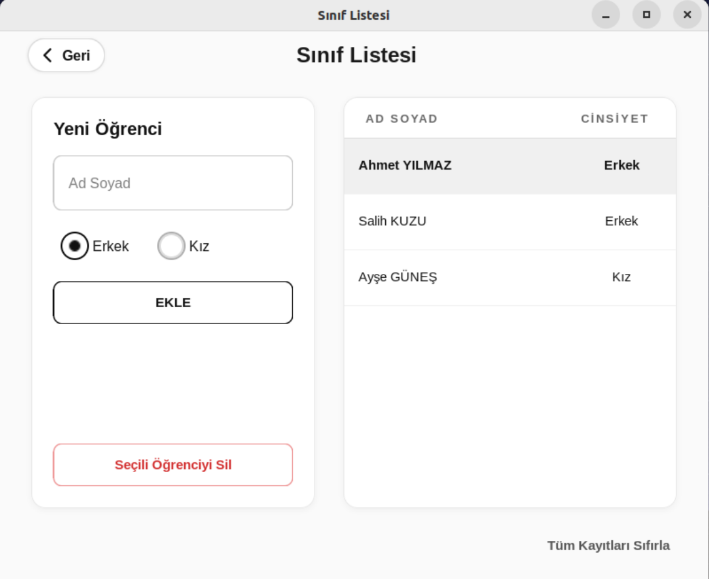

# Rastgeletör - Sınıf Öğrenci Seçme ve Gruplama Aracı

Okullarda akıllı tahta (ETAP) üzerinde kullanılmak üzere tasarlanmış, öğretmenlerin sınıf içi öğrenci seçme ve gruplama aktivitelerini kolaylaştıran modern, hafif ve kullanışlı bir **Python 3 + GTK 4** masaüstü uygulamasıdır.

<div align="center">
  
  
</div>

> **Not:** Ekran görüntülerinde yer alan isimler test amaçlı tamamen rastgele oluşturulmuş olup, gerçek kişilerle hiçbir ilgisi bulunmamaktadır.

## 🎯 Özellikler

- **Rastgele Öğrenci Seçimi**: Sınıftan adil ve rastgele öğrenci seçimi (Minimal, akıllı tahta uyumlu arayüz).
- **Grup Oluşturma**: İstediğiniz grup sayısına veya grup başına düşen kişi sayısına göre otomatik, dinamik gruplama.
- **Cinsiyet Filtresi**: Tüm sınıf, sadece kızlar veya sadece erkekler arasından seçim.
- **Liste Modları**: Eksilen liste (seçilen öğrenci listeye geri dönmez) veya sabit liste (aynı öğrenci tekrar seçilebilir).
- **Öğrenci Yönetimi**: Kolay öğrenci ekleme, silme ve listeleme.
- **Akıllı Tahta Optimizasyonu**: Geniş dokunmatik butonlar (IR touch uyumlu) ve klavye kısayolları.
- **Çevrimdışı Çalışma**: İnternet gerektirmez, veriler yerel SQLite veritabanında saklanır.

---

## 🎮 Kullanım Kılavuzu

### 1- Öğrenci Listesi Oluşturma
1. Ana ekranda "Öğrenci Listesi" butonuna tıklayıp sınıf panosuna girin.
2. Ad soyad ve cinsiyet belirterek **"EKLE"** butonuna tıklayın.
3. Listeyi tamamladığınızda sol üstteki okla geri dönebilir veya dilerseniz verileri tamamen temizleyebilirsiniz.

### 2- Rastgele Öğrenci Seçme (Çekiliş)
1. Ana ekrandan **Seçim Ayarları**na tıklayın.
2. Sabit mi yoksa Eksilen liste mantığı ile mi çekiliş yapacağınızı ve cinsiyet kısıtlamalarını belirleyin.
3. Klavyeden **Enter** tuşuna veya ekrandaki kocaman zara (⚄) tıklayarak rastgele öğrencinizi seçin!

### 3- Grup Oluşturma
1. Sağ üstte yer alan "Gruplayıcı" butonuna tıklayın.
2. "Yeni Gruplandırma" diyerek sınıfı kaça böleceğinizi (kriterleri) belirleyin.
3. Sağ ve sol ok tuşlarına basarak ya da ekrandaki oklara tıklayarak oluşturulan otomatik grupları inceleyin.

---

## 🛠 Geliştiriciler İçin (Kurulum ve Çalıştırma)

Proje, Kotlin tabanlı eski altyapıdan tamamen **Python 3 ve GTK 4** kullanılarak native Linux ekosistemine göç etmiştir.

**Gereksinimler (Ubuntu/Pardus/Arch):**
- Python 3.10+
- GTK 4 & libadwaita
- PyGObject (python3-gi)

**Projeyi Geliştirme Ortamında Çalıştırma:**
```bash
# Sanal ortam oluşturup aktif edin
python3 -m venv --system-site-packages .venv
source .venv/bin/activate

# Uygulamayı çalıştırın
PYTHONPATH=src python3 -m app.main
```

---

## 📦 Dağıtım (Pardus ETAP ve Linux)

Uygulama hem Debian paketi (`.deb`) hem de taşınabilir (portable) `AppImage` formatında kolayca derlenebilir. Otomatik paketleme betikleri `packaging` dizini içerisinde yer alır.

### .deb Paketi Üretme (Debian/Ubuntu/Pardus ETAP)
```bash
./packaging/deb/build_deb.sh

# Oluşan paketi kurmak için:
sudo dpkg -i rastgeletor_2.2.0_all.deb
sudo apt-get install -f
```

### AppImage Üretme (Evrensel Linux)
```bash
./packaging/appimage/build_appimage.sh

# Oluşan AppImage'ı doğrudan çalıştırmak için:
./Rastgeletor-2.2.0-x86_64.AppImage
```

---

## 🗄️ Veritabanı Mimarisi
Uygulama `SQLite` kullanır. Paketleme mantığı gereği uygulamanın kurulu olduğu sistem dizinine (`/usr/share/`) değil, mevcut kullanıcının (öğretmenin) kişisel gizli klasörüne kaydedilir:
- **Konum:** `~/.local/share/Rastgeletor/ogrenciler.db`
Bu sayede uygulama güncellendiğinde veya silinip tekrar yüklendiğinde **öğrenci kayıtları asla kaybolmaz.**

## 🧸 İkon Katkısı
Uygulamanın simgeleri Flaticon'dan alınmıştır.  
<a href="https://www.flaticon.com/free-icons/gaming" title="gaming icons">Gaming icons created by Smashicons - Flaticon</a>

## 📝 Lisans
Bu proje eğitim amaçlı geliştirilmiş olup açık kaynaklıdır.
